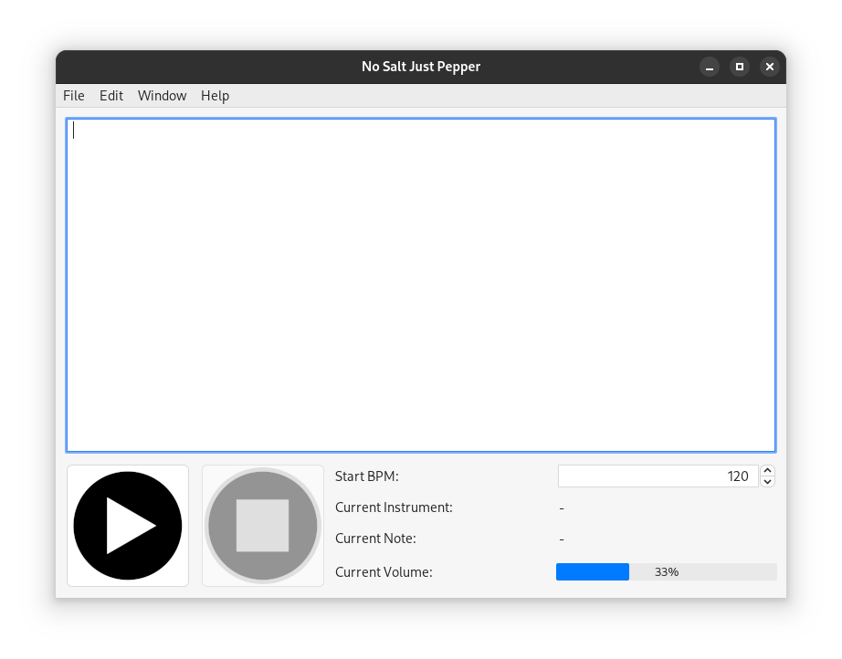

# No Salt Just Pepper

Um gerador de música por texto modular em Java

Trabalho prático desenvolvido na disciplina de Técnicas de Construção de Programas no semestre 2024/2

## Bibliotecas usadas

- [JFugue](http://www.jfugue.org/)
- [Jackson](https://github.com/FasterXML/jackson)
- [Swing](https://docs.oracle.com/javase/tutorial/uiswing/)
- [FlatLaf](https://www.formdev.com/flatlaf/)
- [JUnit 5](https://junit.org/junit5/)
